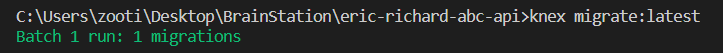
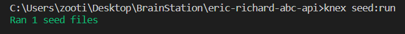

# Welcome!

This is the companion API to [Angelo Boxing Coach](https://github.com/ericjlrichard/eric-richard-abc): an Express API over a mySql database which contains details about featured boxers and their associated combos. Fun!

# Setup

Since there are a few steps to setting up the API (don't worry, setting up [Angelo Boxing Coach](https://github.com/ericjlrichard/eric-richard-abc) after that is a breeze!), here are detailed setup instructions. We can do it!

## knex and mySQL

You'll need to make sure mySQL is working for the server to work.

We'll then need knex to connect to this database.

Replace the information in eric-richard-abc-api/knexfile.js:

> module.exports = { 
  client: 'mysql', 
    connection: { 
    host: '127.0.0.1', 
    user: '`<yourusername>`', 
    password: '`<yourpassword>`', 
    database: '`<emptydatabasename>`', 
    charset: 'utf8', 
  }, 
};

Where `emptydatabasename` should be the name empty database you created earlier ("abc" in the example).

## install node.js server dependencies

In the terminal, in folder "eric-richard-abc-api":

Run "npm install" to install dependencies, including:

- cors
- knex
- mysqlite3
- mysql
- dotenv

## populate database

In console terminal, in the eric-richard-abc-api folder, run "knex migrate:latest" to initialize database structure, you should see this:

>

Then run "knex seed:run" to populate database. You should see this (I know, 1 seed file"S" but what are you gonna do):

>

You can verify it worked by going in mySql, and running `use abc;` (or the name you gave to the database).

Then running `SELECT first_name, last_name from boxer;`

## .env file

Create a file called .env in "eric-richard-abc-api" with the following variables:

PORT = 8080

SESSION_SECRET="ImNotTellingYouWhatTheSessionSecretIs"

The `SESSION_SECRET` variable can be anything, but make sure it matches `REACT_APP_SECRET_KEY` on the app side.

## Enjoy!

Your ABC API should be ready to go! In terminal, in the eric-richard-abc-api directory, run "node server.js" or "nodemon server.js" to activate it.

Make sure it connects with [Angelo Boxing Coach](https://github.com/ericjlrichard/eric-richard-abc), then enjoy your workouts!